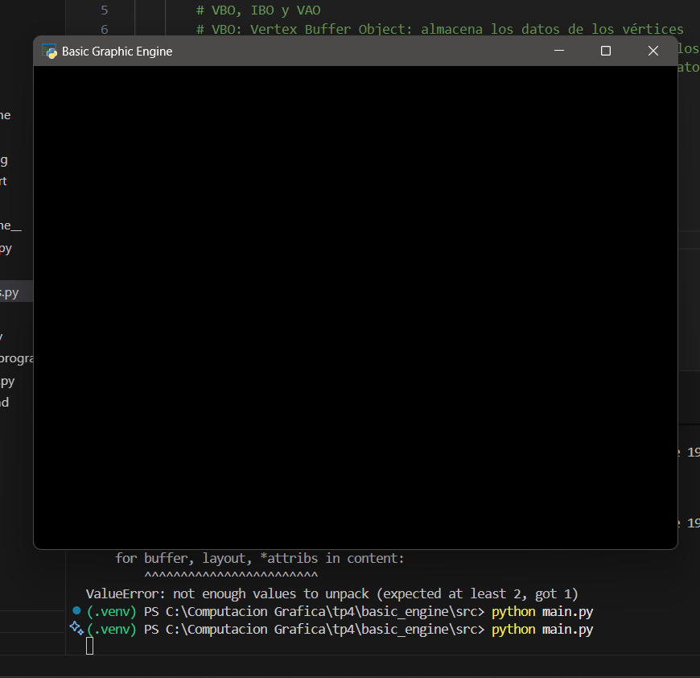
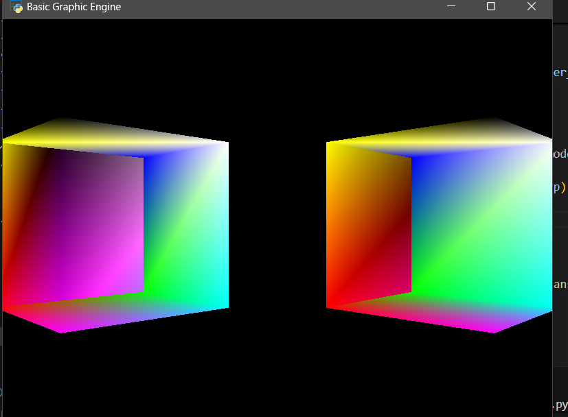
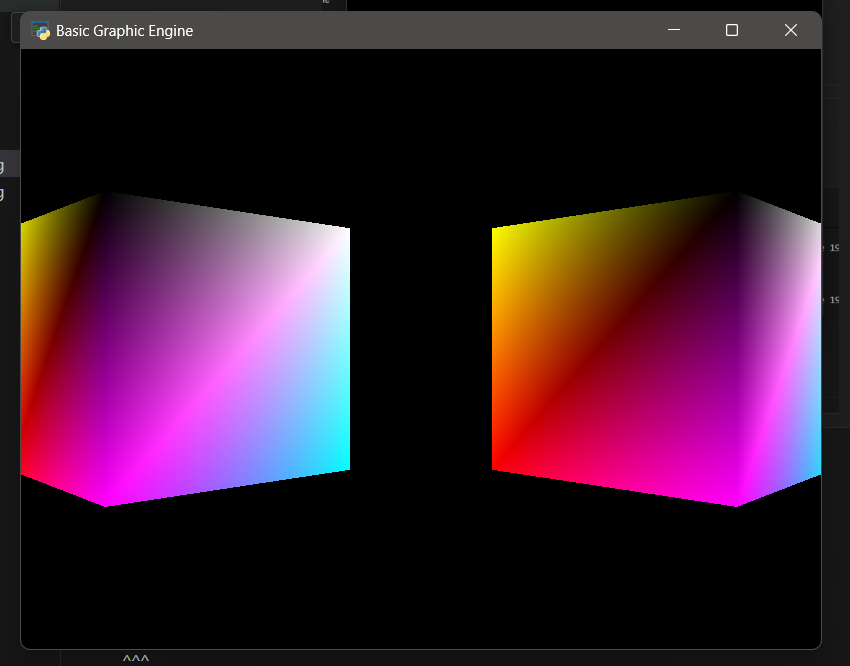

# Motor Gráfico Básico - TP4

Este proyecto implementa un motor gráfico básico en Python usando Pyglet y ModernGL. Permite crear, mover y renderizar figuras geométricas 3D simples, como cubos, en una ventana interactiva.

---

## Requisitos

- Python 3.8 o superior
- Windows, macOS o Linux

---

## Instalación

1. Clona el repositorio o copia la carpeta del proyecto.
2. Abre una terminal en la carpeta principal (`tp4/basic_engine`).
3. Crea y activa el entorno virtual:

   ```powershell
   python -m venv .venv
   .venv\Scripts\activate
   ```

4. Instala las dependencias:

   ```powershell
   pip install pyglet moderngl numpy PyGLM
   ```

---

## Estructura del proyecto

```
basic_engine/
├─ shaders/
│  ├─ basic.vert
│  └─ basic.frag
└─ src/
   ├─ main.py
   ├─ window.py
   ├─ scene.py
   ├─ shader_program.py
   ├─ graphics.py
   ├─ camera.py
   └─ cube.py
```

---

## Ejecución

Desde la carpeta `src`, ejecuta:

```powershell
python main.py
```

Se abrirá una ventana con dos cubos 3D renderizados.

---

## Proceso y soluciones

### 1. **Corrección de rutas para los shaders**

**Problema:**  
El programa no encontraba los archivos de los shaders.

**Solución:**  
Se usó `os.path` para construir la ruta absoluta:

```python
# main.py
import os

shader_dir = os.path.join(os.path.dirname(__file__), '..', 'shaders')
vertex_shader_path = os.path.join(shader_dir, 'basic.vert')
fragment_shader_path = os.path.join(shader_dir, 'basic.frag')
shader_program = ShaderProgram(window.ctx, vertex_shader_path, fragment_shader_path)
```
*Esto asegura que los shaders se carguen correctamente sin importar el directorio de ejecución.*

---

### 2. **Corrección de sintaxis en los shaders**

**Problema:**  
Errores de compilación GLSL por nombres incorrectos de atributos.

**Solución:**  
Se corrigieron los nombres en el shader de vértices:

```glsl
// basic.vert
#version 330

in vec3 in_pos;
in vec3 in_color;
out vec3 v_color;
uniform mat4 Mvp;

void main() {
    gl_Position = Mvp * vec4(in_pos, 1.0);
    v_color = in_color;
}
```
*Los nombres deben coincidir con los usados en el VAO en Python.*

---

### 3. **Configuración correcta del VAO**

**Problema:**  
Error `ValueError: not enough values to unpack (expected at least 2, got 1)`.

**Solución:**  
Se configuró el VAO con el formato correcto:

```python
# graphics.py
self.vao = ctx.vertex_array(
    shader_program.prog,
    [
        (self.vbo, '3f 3f', "in_pos", "in_color"),
    ],
    self.ibo
)
```
*Esto indica que cada vértice tiene 3 floats para posición y 3 para color, y los nombres coinciden con los del shader.*

---

### 4. **Envío de la matriz MVP al shader**

**Problema:**  
Los cubos no se veían porque no se transformaban correctamente.

**Solución:**  
Se calculó y envió la matriz MVP antes de renderizar cada objeto:

```python
# scene.py
def render(self):
    for obj in self.objects:
        mvp = self.projection @ self.view @ obj.get_model_matrix()
        self.graphics[obj.name].set_uniform("Mvp", mvp)
        self.graphics[obj.name].vao.render()
```
*Esto transforma cada objeto según su posición, la cámara y la proyección.*

---

### 5. **Activación del Depth Test**

**Problema:**  
Las caras de los cubos se superponían incorrectamente.

**Solución:**  
Se activó el buffer de profundidad en cada frame:

```python
# window.py
def on_draw(self):
    self.clear()
    self.ctx.clear()
    self.ctx.enable(moderngl.DEPTH_TEST)
    if self.scene:
        self.scene.render()
```
*Esto permite que la GPU dibuje correctamente las caras según su profundidad.*

---

## Evidencias




---

## Reflexión

- Si no se envía la matriz MVP al shader, los objetos no se ven correctamente porque no se transforman según la cámara y la proyección.
- El buffer de profundidad es esencial para que los objetos se dibujen en el orden correcto según su distancia a la cámara.
- Cada objeto necesita su propia matriz MVP porque puede tener transformaciones distintas.

---
