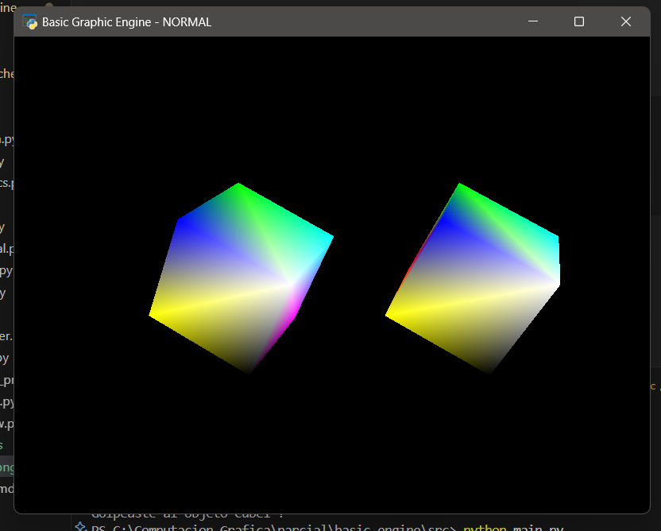
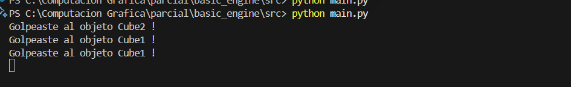
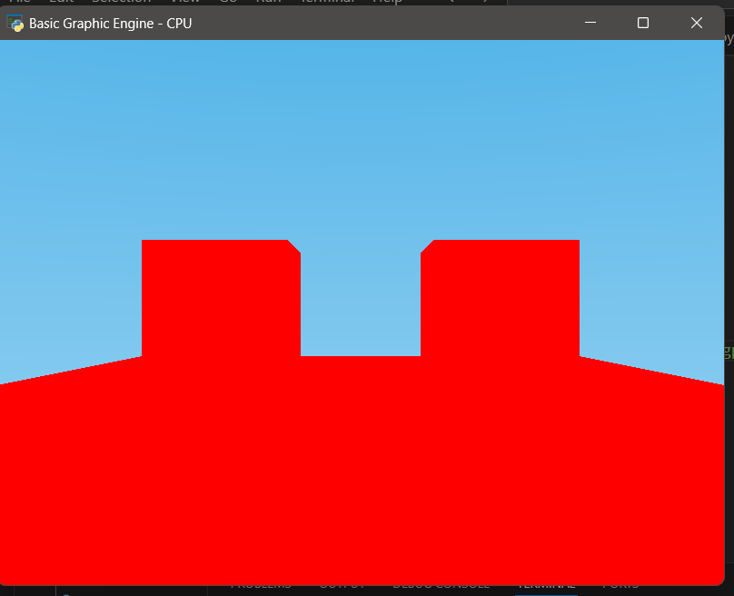
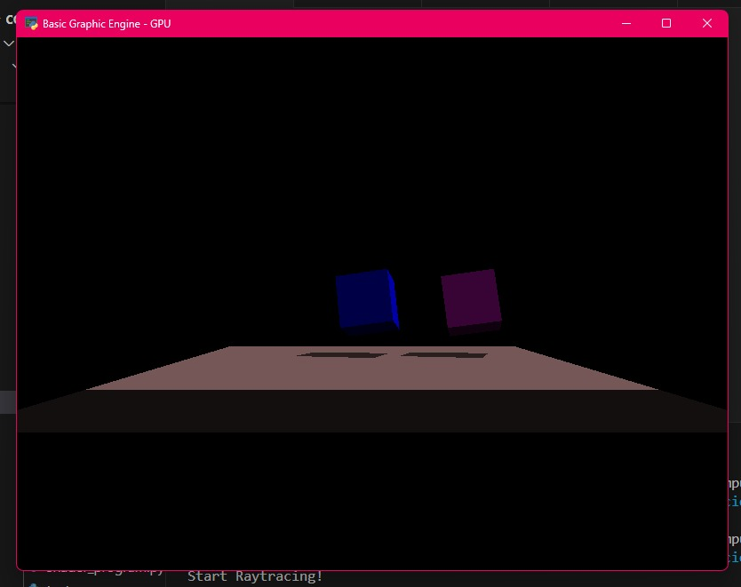

# Proyecto de Computación Gráfica: Motor Básico con Raytracing CPU y GPU

## Descripción

Este proyecto implementa un motor gráfico básico en Python utilizando **ModernGL** y **Pyglet**. Permite visualizar escenas 3D con renderizado tradicional (Vertex/Fragment Shader), raytracing por CPU y raytracing por GPU (Compute Shader). Incluye soporte para materiales, texturas, animación, detección de colisiones y un sistema de cámara flexible.

---

## Modos de Renderizado

- **Normal:** Renderizado tradicional con Vertex y Fragment Shader.
- **CPU:** Raytracing realizado completamente en Python, píxel por píxel.
- **GPU:** Raytracing acelerado por GPU usando Compute Shader y SSBOs.

La configuración de la escena (objetos, materiales, tamaño y posición de los quads) se adapta según el modo para asegurar el funcionamiento correcto y la visualización esperada.

---

## Primitivas y Modelos

- **Triángulos:** Unidad básica de construcción.
- **Quad:** Compuesto por 2 triángulos.
- **Cube:** Compuesto por 12 triángulos (2 por cada cara).

---

## Estructura del Proyecto

- **Modelos:** Clases `Cube`, `Quad`, etc.
- **Materiales:** Clases `Material`, `StandardMaterial`.
- **Texturas:** Clase `Texture`.
- **Cámara:** Clase `Camera` con matrices de vista y proyección.
- **Raytracer:** Clases `RayTracer` (CPU) y `RayTracerGPU` (GPU).
- **Escena:** Clases `Scene`, `RayScene`, `RaySceneGPU`.
- **Colisiones:** Clases `HitBox`, `HitBoxOBB` para detección eficiente.
- **Shaders:** Vertex, Fragment y Compute Shaders escritos en GLSL.

---

## Cuestionario de la Profe (Respuestas)

### General de Computación Gráfica

- **Modelo de color:** RGB (y RGBA). Usado porque las pantallas mezclan luz roja, verde y azul.
- **Primitivas gráficas:** Triángulos.
- **Producto escalar:** Calcula ángulos/proyecciones entre vectores. Devuelve un escalar (float).
- **Producto vectorial:** Calcula un vector perpendicular. Devuelve un vector.
- **Coordenada homogénea w para punto:** 1 (afecta traslación).
- **Coordenada homogénea w para dirección:** 0 (no afecta traslación).
- **Transformación entre espacios:** Matriz de transformación (4x4).
- **Dimensiones de matriz:** 4x4 para 3D homogéneo.
- **Inversa de matriz:** Deshace transformaciones (ej: pasar de cámara a mundo).
- **Espacio del Objeto:** Coordenadas locales del objeto.
- **Espacio del Mundo:** Coordenadas globales de la escena.
- **Espacio de Vista:** Coordenadas relativas a la cámara.
- **Origen en pantalla:** Depende del sistema (OpenGL: esquina inferior izquierda).
- **Origen en objeto:** Centro geométrico.
- **Coordenadas NDC:** Normalizadas de -1 a 1.
- **Proyección perspectiva vs ortográfica:** Perspectiva simula profundidad, ortográfica no.
- **VBO, IBO, VAO:** Buffers y organización de datos de vértices.
- **Normal de un vértice:** Dirección perpendicular a la superficie.
- **Lenguaje de shaders:** GLSL.
- **Vertex Shader:** Procesa vértices.
- **Fragment Shader:** Procesa fragmentos (píxeles).
- **Orden de ejecución:** Vertex Shader → Rasterización → Fragment Shader.
- **Compute Shader:** No recorre unidades geométricas, ejecuta work groups en GPU.
- **Vertex/Fragment vs Compute Shader:** Los primeros están atados al pipeline, el Compute es general y paralelo.
- **Work group:** Grupo de hilos en Compute Shader.
- **Uniforms:** Variables globales para todos los shaders; atributos varían por vértice.
- **Sampler2D:** Uniform para texturas 2D.
- **Ray:** Semirrecta con origen y dirección.

### Proyecto

- **Matrices de transformación:** En modelos y cámara.
- **Origen de los Rays:** Desde la cámara hacia cada píxel.
- **HitBox:** Detecta colisiones rayo-objeto.
- **Rays para mouse picking:** Solo uno.
- **Pyglet:** Ventana, loop y eventos.
- **ModernGL:** Wrapper de OpenGL para Python.
- **Atributos de Model:** Vértices, índices, colores, normales, texcoords.
- **Ventaja de separar atributos:** Flexibilidad y eficiencia.
- **Nombres de atributos:** Deben coincidir con los del shader.
- **Paso de atributos al shader:** VBOs y VAO.
- **Material:** Relaciona shader y texturas.
- **Texture:** Almacena imagen y la convierte a bytes para OpenGL.
- **Nombres de texturas:** Deben coincidir con los uniforms del shader.
- **Cambio de color de cubo:** Cambiar la textura y el material.
- **Animación de cubo:** Usar `animated=False` para desactivar.
- **UV en Fragment Shader:** Para mapear texturas.
- **No multiplicar por MVP:** El objeto no se transforma correctamente.
- **Depth Test deshabilitado:** No se ocultan fragmentos detrás de otros.
- **Vertex-Fragment Shader:** Se ejecuta por objeto.
- **Raycasting vs Raytracing:** Raycasting solo colisión, Raytracing calcula color, sombras, etc.
- **Rays por frame:** Uno por píxel (depende de la resolución).
- **Uso de Quad en Raytracing:** Para mostrar la textura generada.
- **Parámetro hittable:** Controla si el objeto es colisionable.
- **Quad completamente rojo:** Probablemente hittable=True o demasiados objetos.
- **Color del cielo:** En la clase Camera con `set_sky_colors`.
- **Trazado de rayos CPU:** En `trace_ray` de `RayTracer`.
- **Raytracing CPU vs GPU:** CPU es secuencial, GPU es paralelo.
- **Color del cielo en GPU:** En el Compute Shader, se puede pasar como uniform.
- **Trazado de rayos GPU:** En el Compute Shader, resultado es una textura.
- **Raytracer vs RaytracerGPU:** CPU hace todo en Python, GPU delega a Compute Shader.
- **Por qué Compute Shader:** Permite acceso global y paralelo a toda la escena.
- **Datos complejos al Compute Shader:** Usamos SSBOs.
- **SSBOs:** Buffers para datos complejos y grandes.
- **Declaración de SSBO:** Con `buffer` y `layout(binding=...)` en GLSL.
- **Importancia del binding:** Es lo que importa, no el nombre.
- **models_f:** Matrices de transformación de objetos.
- **inv_f:** Matrices inversas de transformación.
- **mats_f:** Materiales de los objetos.
- **primitives:** Información geométrica para el BVH.
- **BVH:** Optimiza colisiones agrupando objetos.
- **Luz perpendicular:** Máxima iluminación.
- **Luz paralela:** Sin iluminación directa.
- **Luz ambiental:** Iluminación base uniforme.
- **Luz difusa:** Sombreado según ángulo de la luz.
- **Luz especular:** Brillos/reflejos puntuales.
- **Sombras más oscuras:** Reducir el valor devuelto en `calculateShadow`.

---

## Notas y Solución a Problemas

- **Al agregar soporte GPU, la configuración de la escena (especialmente el tamaño y posición del quad) debe adaptarse para cada modo.**
- **Si en modo "normal" o "cpu" solo ves un cubo o el fondo no aparece, revisa:**
  - Que ambos cubos estén agregados a la escena.
  - Que el quad (piso) no tape toda la pantalla o tenga `hittable=False` si solo es para mostrar la textura.
  - Que los objetos tengan `animated=False` si no quieres que se muevan o roten inesperadamente.

---

## Ejecución

1. Instala dependencias:

`pip install pyglet moderngl PyGLM numpy`

2. Ejecuta el proyecto:

`python main.py`

3. Cambia el modo de renderizado (`SCENE_TYPE`) en `main.py` según lo que quieras probar. (`normal`, `cpu`, `gpu`)

---

## Evidencias

